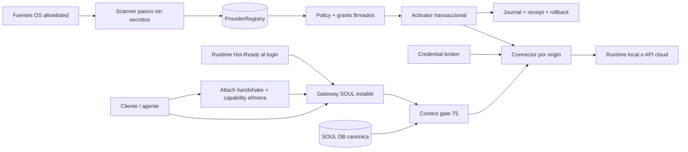

# SOUL Model Auto-Wire v1

- **Estado:** SPEC COMPLETE v1.2 — compatibilidad mundial abierta por protocolos; no desplegada
- **Fecha:** 2026-08-20
- **Owner de diseño e integración:** ADA
- **Propietario y autoridad final:** William Tovar
- **Alcance inicial:** SOUL Core + SOUL Platform en Windows, Linux y macOS
- **Mística:** *un cerebro aparece; SOUL lo reconoce, lo prueba y lo conecta sin perder el alma.*

## 1. Propósito

SOUL debe dejar de depender de que una persona conozca nombres de proveedores,
puertos, variables de entorno o comandos `switch-brain`. Cuando un runtime local,
un modelo nuevo o una API compatible aparece en la máquina, SOUL debe:

1. detectarlo de forma acotada;
2. identificar su protocolo y modelos disponibles;
3. verificar compatibilidad con canarios sintéticos;
4. registrarlo como cerebro candidato;
5. cablearlo a la misma identidad y memoria persistentes según una política explícita;
6. mantener rollback y evidencia de cada transición.

El resultado buscado no es “un chat más”. Es que **cualquier cerebro compatible
pueda habitar la misma alma** sin que el usuario tenga que rehacer la integración.

“Cualquier” no se implementa con una lista infinita de marcas. Se implementa con
un **núcleo de protocolos estable**, un SDK de adapters verificables y un catálogo
de evidencia. Un proveedor, modelo, runtime o app futura —de China, Estados
Unidos, Europa o cualquier otra región— entra sin modificar SOUL Core cuando
declara un protocolo soportado o aporta un adapter que supera la misma suite de
conformidad. El país nunca concede ni quita confianza.

SOUL opera como un auto de carreras en la parrilla: el runtime y el gateway ya
están encendidos antes de abrir Codex, Claude o una app/API compatible. La app no
arranca SOUL ni copia el alma; ejecuta un handshake corto contra un endpoint local
estable y obtiene una sesión autorizada sobre la misma identidad persistente.

## 2. Definición exacta de “automático”

“Automático” se divide en cuatro operaciones distintas:

| Operación | Local/loopback | Cloud/API remota |
|---|---:|---:|
| Detectar presencia | Automático | Solo capacidad potencial desde metadata local; cero red |
| Registrar como candidato | Automático | Automático |
| Verificar protocolo con canario sintético | Automático y sin SOUL | Solo tras consentimiento y presupuesto |
| Enviar identidad/memoria real | Solo instancia/modelo previamente autorizado | Consentimiento explícito firmado por proveedor/ruta |

La instalación de un SDK o la presencia de una variable como `OPENAI_API_KEY`
permite detectar una **capacidad potencial**; no autoriza a leer, copiar ni usar la
credencial. La configuración guarda un *credential handle*, nunca el valor.

SOUL no interceptará tráfico TLS, no modificará aplicaciones cerradas y no
inyectará código en procesos de terceros. Una aplicación propietaria solo puede
usar SOUL si ofrece una superficie oficial: base URL configurable, plugin,
extensión, SDK o API. En los demás casos SOUL registra el cerebro para usarlo como
upstream propio, pero no afirma que la aplicación quedó transformada.

## 3. Separación Core / Platform

### 3.1 SOUL Core

Core conserva únicamente contratos puros que ya tengan dos consumidores
independientes. El incremento A no promoverá prematuramente transporte, endpoint,
credenciales o políticas del SO a su API pública. El protocolo mínimo actual
`LLMProvider.generate()` permanece estable.

Los siguientes contratos nacen como **NEW en Platform** y solo se promoverán a
Core cuando exista portabilidad demostrada:

- `BrainDescriptor`
- `BrainCapabilities`
- `BrainAdapter` protocol
- `BindingPolicy`
- `BindingReceipt`
- invariantes de identidad/memoria durante un cambio de cerebro

Core **no** escanea procesos, puertos, archivos ni credenciales. Sigue siendo una
biblioteca soberana y portable.

### 3.2 SOUL Platform

Platform implementa la integración con el sistema operativo:

- `soul-model-watch`: **NEW**, manager/reconciliador por usuario;
- scanner subprocess: **NEW**, detector sin estado ni autoridad;
- activator: **NEW**, única autoridad de cambio de binding;
- credential broker: **NEW**, única autoridad sobre secretos;
- `ProviderRegistry`: **NEW**, registro operacional durable;
- adaptadores de proveedor;
- probes de compatibilidad;
- custodia de credenciales mediante el almacén del SO;
- transición atómica y rollback del proxy SOUL;
- interfaz en tray y CLI.

El registro operacional no es una segunda memoria canónica. La identidad, OCEAN,
relaciones y recuerdos siguen viviendo únicamente en la SOUL DB.

### 3.3 Baseline medido en el workspace

La auditoría del código actual encontró una base reutilizable y un gap acotado:

- `proxy.py` ya funciona como gateway OpenAI-compatible autenticado sobre
  loopback, pero mantiene un solo upstream estático;
- `bootstrap.py::switch_upstream()` ya escribe atómicamente, conserva alma/DB/token
  y contiene rollback;
- Platform ya instala autostart per-user para el proxy y el MCP SOUL vive en
  `127.0.0.1:8771`; existe `soul_runtime_orchestrator.py`. Falta un readiness
  agregado y el attach oficial/automático por cliente;
- `tray.py` solo descubre Ollama y fuerza Ollama al seleccionar;
- los instaladores solo detectan Ollama;
- `upstream_kind` hoy es metadata: no selecciona un protocolo distinto;
- Core expone Stub/Ollama, y `Soul._create_impl()` no activa automáticamente
  `config.llm_provider` sin un objeto provider entregado por el caller;
- no existe catálogo persistente, último cerebro sano ni resolución multi-provider.

La auditoría del árbol `871a3429`/`7e39fa1e` encontró un bloqueo de release
reproducible: Platform fija `soul-framework==0.4.2`, mientras el Framework local
declara `0.3.0`; además, los tests del proxy esperan `BgeM3Embedding`, el Framework
expone `BGEM3Embedding` y Platform posee `LocalBgeM3Embedding`. Una ejecución
actual desde el workspace tampoco puede coleccionar la suite sin instalar
`aiosqlite`. Por tanto no se congela ningún conteo verde no reproducido ni receipt
inexistente: el gate de release queda **ROJO** hasta alinear versión, símbolos,
lockfile y suite en un venv limpio ligado por SHA-256.

El incremento A envuelve y endurece el proxy local existente. Cloud requiere
**proxy/dataplane v2** (protocolos nativos, broker, consentimiento y presupuesto):
no se presentará como una simple extensión compatible del proxy v1.

### 3.4 Arquitectura normativa



La “magia” no consiste en reconfigurar ni interceptar cada aplicación instalada.
SOUL mantiene un **endpoint local estable**; las aplicaciones compatibles se
configuran una sola vez contra ese endpoint. Auto-Wire reconcilia los cerebros
aguas arriba. Para clientes cerrados sin `base_url`, plugin, SDK o API oficial,
solo registra `UNSUPPORTED_CLIENT`; nunca hace MITM, parcheo de binarios ni
inyección.

**Propiedad de autoridad:** scanner observa; registry recuerda; policy decide;
activator cambia; broker usa credenciales; connector transmite. Ninguna pieza
puede asumir dos de esas autoridades en el mismo proceso de confianza.

### 3.5 Mapa de módulos a construir

```text
soul_platform/autowire/
  types.py                    # descriptors, capabilities, states, events
  registry.py                 # SQLite + migrations + CAS
  discovery.py                # orchestration, debounce, reconciliation
  discoverers/{ollama,lmstudio,llamacpp,installed_clients}.py
  adapters/{base,openai_compat,anthropic_messages,gemini_native}.py
  fingerprint.py              # endpoint + process/socket attestation
  probe.py                    # passive and synthetic canaries
  policy.py                   # selection, grants, data classes, budgets
  credentials.py              # handles only; IPC to external broker
  connector.py                # exact origin/header isolation
  activator.py                # journal, fencing, restart, rollback
  watcher.py                  # per-user daemon
  events.py                   # typed audit events/receipts
```

`proxy.py`, `bootstrap.py`, tray e installers se convierten en consumidores de
este paquete; no duplican discovery ni policy. Core recibe un `ChatProvider`
versionado y portable solo cuando los adaptadores Platform y un segundo consumidor
demuestren el contrato. `switch-brain` queda como wrapper compatible.

Eventos normativos: `ProviderDetected`, `ProviderChanged`, `ModelsChanged`,
`ProviderReady`, `BindingProposed`, `BindingActivated`, `BindingRejected`,
`BindingRolledBack`, `ProviderStale`, `ProviderRemoved`, `FailoverActivated` y
`GrantRevoked`. Todos llevan schema version, generation y digest; ninguno contiene
prompt, respuesta o secreto.

## 4. Invariantes no negociables

1. **El cerebro cambia; el alma no.** `machine_soul_id`, base SOUL, token local,
   OCEAN, relaciones y hashes de memoria permanecen invariantes.
2. **Detección no implica autoridad.** Encontrar un proceso, endpoint, SDK o
   credencial no permite usarlo hasta satisfacer su política.
3. **Cero secretos en TOML, logs o receipts.** Solo se persisten referencias a
   credenciales custodiadas por el SO.
4. **Todo egreso visible.** Antes del primer envío se informa que pueden salir:
   mensaje, system prompt, OCEAN/relaciones, public few-shot, recuerdos
   seleccionados, contexto conversacional/técnico, attachments, esquemas y
   resultados de herramientas, respuesta y candidatos a persistencia.
5. **Sin escaneo de red.** El descubrimiento automático solo prueba loopback y
   endpoints declarados; nunca barre LAN, Tailscale, subredes o DNS.
6. **Sin redirects.** Todo probe rechaza redirecciones, rebinding, URL con
   credenciales, IP de metadata y cambio de host/puerto.
7. **Fail-closed.** Respuesta ambigua, excesiva, mal formada o incompatible deja
   al candidato en cuarentena y conserva el cerebro anterior.
8. **Semántica honesta de swap.** En v1, el restart puede cortar requests en vuelo
   con `503/retry`; no se promete continuidad. v2 usará clientes por generación,
   refcount y drain antes de retirar el anterior.
9. **Idempotencia.** Repetir discovery/reconcile no duplica proveedores ni cambia
   el alma.
10. **Rollback verificable.** Si health/ready/canario falla después del cambio,
    se restaura la configuración anterior y se verifica por efecto.
11. **Embedding separado del LLM.** Cambiar el cerebro generativo no cambia ni
    migra embeddings. BGE-M3/cutover conserva su propio gate reversible.
12. **Instalar ≠ descargar.** Auto-Wire detecta y cablea artefactos presentes; no
    baja modelos ni paquetes adicionales sin una política de instalación aparte.
13. **Separación de poderes real.** En modo seguro, scanner subprocess con
    restricted token/sandbox, sin entorno heredado, filesystem read-only y JSON
    acotado; manager dueño del registro; activator único escritor del binding;
    broker único lector del secreto; connector recibe solo contexto filtrado. IPC
    por UDS/capability y ACL del SO, nunca token de chat. Sin sandbox estructural,
    solo discovery built-in pasivo: sin adapters externos ni activación automática.
14. **HTTP 200 no significa confiable.** Un candidato permanece no confiable hasta
   completar identidad/capabilities, consentimiento aplicable y canario.
15. **Respuesta no es autoridad.** Texto, tool call, config, consentimiento o
    memoria sugeridos por un upstream nunca se ejecutan sin policy, principal y
    aprobación aplicables; una respuesta no puede concederse scopes.
16. **SOUL antes del turno.** El runtime Hot-Ready arranca con la sesión del SO y
    verifica identidad/DB/policies/registry. Si Codex o Claude abre antes de que
    termine, su connector espera `READY` o falla visible; nunca bypass. Mantiene
    índices disponibles, no vuelca recuerdos privados en RAM ni abre cloud hasta
    que exista una sesión autorizada.
17. **Mundo abierto, claim cerrado.** El catálogo de marcas es extensible y nunca
    es la única vía de integración. Un adapter nuevo puede ampliar cobertura sin
    tocar Core ni la SOUL DB; sin embargo, solo niveles L3/L4 (§5.2) pueden usar la
    etiqueta “SOUL-compatible”. “Detectado”, “habla OpenAI” o “HTTP 200” no
    significan compatible, seguro ni certificado.

## 5. Modelo universal de proveedor

```python
@dataclass(frozen=True)
class BrainDescriptor:
    provider_id: str          # estable: ollama, lm-studio, openai, anthropic...
    instance_id: str          # huella del endpoint/instalación, no secreto
    transport: str            # loopback-http | cloud-https | broker | subprocess
    protocol: str             # openai-chat | openai-responses | anthropic-messages
    canonical_origin: str
    model_id: str
    local: bool
    capabilities: BrainCapabilities
    credential_ref: str | None  # handle opaco; nunca label de cuenta/persona
    discovered_by: str
    evidence_digest: str

@dataclass(frozen=True)
class BrainCapabilities:
    chat: bool
    responses: bool
    streaming: bool
    tools: bool
    json_schema: bool
    vision: bool
    audio: bool
    embeddings: bool
    context_window: int | None
```

Los IDs se normalizan, se acotan en longitud y no pueden contener caracteres de
control. Las capacidades se obtienen por evidencia; no se infieren solo por la
marca del proveedor.

Contrato **NEW** mínimo del adapter Platform:

```python
class BrainAdapter(Protocol):
    def discover(self) -> tuple[BrainDescriptor, ...]: ...
    async def passive_probe(self, candidate) -> ProbeEvidence: ...
    async def active_canary(self, candidate, capability) -> CanaryEvidence: ...
    def auth_requirements(self, candidate) -> AuthProfile: ...
    async def list_models(self, candidate) -> tuple[ModelDescriptor, ...]: ...
    async def chat(self, request, binding) -> ChatResult: ...
    async def stream_chat(self, request, binding) -> AsyncIterator[ChatEvent]: ...
```

Cada adapter declara paths y nombres/formatos de auth permitidos, pero nunca ve
el secreto ni el header final. El broker recibe
`AuthProfile+credential_ref+canonical_origin`, construye el header y lo entrega
directamente al connector. Además declara límites de bytes/profundidad,
timeouts, retry/circuit-breaker, canonicalización y errores tipados. El connector
destruye los headers al cambiar de origin. Reintentos de generación requieren
idempotencia/reserva de presupuesto y nunca duplican costo ni hacen fallback
silencioso a otra cuenta/proveedor.

El cliente que se conecta al alma es un eje distinto del cerebro upstream:

```python
@dataclass(frozen=True)
class ClientAttachProfile:
    client_id: str             # codex, claude-desktop, claude-code, sdk...
    client_instance_id: str    # app/install manifest digest
    transport: str             # mcp-http | mcp-stdio | uds | named-pipe | openai-http
    canonical_endpoint: str
    requested_scopes: tuple[str, ...]
    launch_binding: str        # config | extension | sdk-base-url | explicit
    evidence_digest: str

@dataclass(frozen=True)
class SoulAttachSession:
    session_id: str
    machine_soul_id: str
    client_instance_id: str
    principal_digest: str
    scopes: tuple[str, ...]
    policy_digest: str
    issued_at: str
    expires_at: str
    capability_digest: str
```

Detectar un cerebro y adjuntar una app no son la misma transición. Un
`BrainDescriptor` decide **quién piensa**; `ClientAttachProfile` decide **qué app
puede conversar con el alma**. Ninguno hereda grants del otro.

### 5.1 Universal Adapter SDK y manifest firmado

SOUL usa una arquitectura abierta de tres tipos de adapter:

- `brain`: traduce un API/modelo upstream a los contratos de generación;
- `runtime`: descubre y atesta un servidor local o proceso administrado;
- `client`: conecta una app a SOUL mediante MCP, base URL, plugin o SDK oficial.

El adapter no contiene identidad, recuerdos ni secretos y no puede abrir la SOUL
DB. Es una traducción acotada que corre fuera del proceso de confianza. Su
manifest canónico mínimo es:

```python
@dataclass(frozen=True)
class AdapterManifestV1:
    adapter_id: str
    adapter_version: str
    vendor: str
    kind: str                    # brain | runtime | client
    protocols: tuple[str, ...]
    transports: tuple[str, ...]
    canonical_origins: tuple[str, ...]
    auth_profile_ids: tuple[str, ...]
    capability_claims: tuple[str, ...]
    discovery_method: str
    regions: tuple[str, ...]
    data_policy_refs: tuple[str, ...]
    core_api_range: str
    platform_api_range: str
    conformance_version: str
    artifact_sha256: str
    sbom_sha256: str
    signer_key_id: str
    revocation_epoch: int
```

El manifest se serializa con JSON canónico, se firma y se liga al hash del
artefacto y su SBOM. `canonical_origins` y `auth_profile_ids` son allowlists, no
sugerencias. Un adapter no puede leer el keychain, construir headers secretos,
seguir redirects, invocar shell, cargar librerías por `PATH`, leer memoria ni
ampliar scopes. Broker, connector, T5 y policy permanecen fuera de su autoridad.

Ciclo de vida:

```text
UNKNOWN -> INSTALLED_UNTRUSTED -> MANIFEST_VERIFIED -> CONFORMANCE_PASSED
  -> OWNER_APPROVED -> ENABLED
ANY -> QUARANTINED | REVOKED
```

La instalación de terceros es explícita. El descubridor puede generar un
`candidate manifest` usando **solo datos sintéticos**, pero jamás descarga ni
ejecuta código sugerido por el endpoint. Publicar adapters comunitarios requiere
trust root separada, transparencia del artefacto y revocación durable.

### 5.2 Niveles de compatibilidad y catálogo mundial

| Nivel | Significado medido | Claim permitido |
|---|---|---|
| L0 Inventory | app/runtime/model detectado pasivamente | `detectado` |
| L1 Protocol | handshake y canario sintético de un protocolo | `protocol-compatible` |
| L2 Attach | integración oficial MCP/base URL/plugin/SDK funciona | `attach-compatible` |
| L3 SOUL Safe | auth, T5, consentimiento, budget, rollback y negativos verdes | `SOUL-compatible` |
| L4 Certified | E2E vivo sobre versión/región exactas + reviewer independiente | `SOUL-certified` |

El catálogo es evidence-first, nunca una tabla de marketing. Cada fila liga:

```text
adapter/version + provider + model/revision + app/version + runtime/version
+ protocol + transport + región + capabilities realmente probadas
+ fecha + conformance_version + evidence_digest + reviewer_receipt + estado
```

Un cambio de versión, endpoint, región, protocolo, retención o capacidad degrada
la fila a L1/L2 hasta revalidar. “OpenAI-compatible” describe una familia de wire
protocol; no garantiza tool calls, streaming, JSON, errores, `stop`, usage ni
semántica idéntica. La conformance suite prueba esas diferencias por capacidad.

### 5.3 Espina universal de protocolos

El primer catálogo de protocolos, ampliable sin tocar la memoria, es:

| Familia | Uso | Adapter base |
|---|---|---|
| OpenAI Responses | generación/tooling moderno | `openai_responses_v1` |
| OpenAI Chat Completions | mayor denominador común cloud/local | `openai_chat_v1` |
| Anthropic Messages | Claude y compatibles nativos | `anthropic_messages_v1` |
| Google Gemini native | capacidades Gemini no representables fielmente | `gemini_generate_v1` |
| Ollama native | inventario/show/generate local | `ollama_native_v1` |
| MCP | attach de apps y herramientas | `mcp_attach_v1` |
| subprocess/llama.cpp | runtime local explícito y atestado | `local_process_v1` |

Nuevos protocolos se agregan por versión (`*_v2`) con negociación explícita; no
se cambia silenciosamente el significado de uno existente. Un adapter puede
ofrecer varias familias, pero cada una obtiene evidencia y estado separados.

## 6. Proveedores y descubrimiento v1

### 6.1 Locales — registro/canario automáticos; memoria según autorización

| Proveedor | Evidencia primaria | Puerto inicial | Protocolo de generación |
|---|---|---:|---|
| Ollama | `GET /api/tags` | 11434 | API Ollama y OpenAI-compatible |
| LM Studio | `GET /v1/models` | 1234 | OpenAI-compatible en v1A |
| llama.cpp | `GET /health`, `GET /v1/models` | 8080 | OpenAI-compatible en v1A |
| LocalAI | `GET /v1/models` | declarado/proceso | OpenAI-compatible |
| vLLM | `GET /v1/models` | declarado/proceso | OpenAI-compatible |
| SGLang | endpoint/model list declarado | declarado/proceso | OpenAI-compatible, por conformance |
| MLX-LM server | endpoint/model declarado | declarado/proceso | OpenAI-compatible, por conformance |
| TensorRT-LLM server | manifest/endpoint declarado | declarado/proceso | adapter versionado |
| servidor custom | endpoint explícitamente registrado | explícito | OpenAI-compatible |

Solo se prueban puertos defaults conocidos en `127.0.0.1`/`::1` y puertos
derivados de un proceso o configuración del propio usuario. Una respuesta de
`/v1/models` no basta para identificar la marca: el descriptor conserva
`provider_id=openai-compatible` hasta que haya una firma no ambigua.

El canario prueba compatibilidad, no identidad. Platform DEBE intentar ligar el
listener a PID, usuario, ejecutable canónico, manifest permitido, versión/hash y
argumentos. Solo una instancia atestada y cubierta por una política owner firmada
puede entrar en `local-auto`. Si no puede atestarse, permanece `UNATTESTED`, la UI
muestra **“candidato compatible; memoria bloqueada”** y exige consentimiento
explícito antes del primer byte de identidad/memoria. Un upgrade local no amplía
automáticamente el scope de `instance_id+model+revision` autorizado.

### 6.2 Cloud — registro automático, uso consentido

| Proveedor | Protocolo preferido | Descubrimiento de capacidad |
|---|---|---|
| OpenAI | Responses; Chat fallback | paquete/CLI/app solo como hint; credential ref explícito |
| Anthropic | Messages | paquete/CLI/app solo como hint; credential ref explícito |
| Gemini | nativo; OpenAI-compatible fallback | SDK/app hint + proyecto/región/ref explícitos |
| DeepSeek | OpenAI-compatible | SDK/app hint + credential ref explícito |
| Alibaba/Qwen DashScope | nativo/OpenAI-compatible según región | SDK/app hint + región/workspace/ref explícitos |
| Zhipu/GLM | nativo/OpenAI-compatible según oferta | manifest/ref explícito + canario de capacidades |
| Moonshot/Kimi | nativo/OpenAI-compatible según oferta | manifest/ref explícito + región |
| Baidu Qianfan/ERNIE | OpenAI/Anthropic-compatible o nativo | workspace/ref/región explícitos |
| Tencent Hunyuan | OpenAI-compatible o nativo | manifest/ref explícito + test de diferencias |
| ByteDance Doubao/Volcengine Ark | OpenAI-compatible o nativo | endpoint/ref/región explícitos |
| MiniMax | Anthropic/OpenAI-compatible según modelo | manifest/ref explícito + conformance separada |
| 01.AI/Yi | protocolo declarado por deployment | adapter/endpoint/ref explícitos |
| SenseNova/SenseTime | protocolo declarado por deployment | adapter/endpoint/ref explícitos |
| Huawei Cloud/Pangu | protocolo declarado por deployment | adapter/endpoint/ref/región explícitos |
| Mistral | nativo/OpenAI-compatible | SDK/app hint + credential ref explícito |
| xAI | OpenAI-compatible | SDK/app hint + credential ref explícito |
| OpenRouter | OpenAI-compatible | manifest/ref explícito; ruta efectiva consentida |
| Groq | OpenAI-compatible | SDK/app hint + credential ref explícito |
| Azure OpenAI | OpenAI-compatible con deployment | tenant/deployment/ref explícitos |
| Custom HTTPS | adapter+manifest firmado/entrada explícita | nunca por escaneo de Internet |

SOUL puede detectar por metadata no secreta que un paquete, CLI, aplicación o
manifest de integración existe. **No** enumera `.env`, perfiles, `~/.config`,
directorios del SDK, stores de secretos ni el entorno/cmdline completo buscando
keys. Un `credential_ref` solo nace por provisión explícita de William/usuario o
por un flujo oficial OAuth PKCE/device-flow permitido por el proveedor. Antes de
consentimiento+budget no hace DNS, TCP, TLS ni request cloud: el estado solo puede
ser `POTENTIAL_CAPABILITY`, no transporte/protocolo verificado.

No se reutilizan sesiones de navegador, cookies, tokens de ChatGPT/Claude Code,
archivos OAuth de terceros ni credenciales de suscripción de usuario. Las claves
cloud deben ser dedicadas por máquina/propósito, revocables y con presupuesto.

### 6.3 Fuentes del sistema operativo

- **Windows:** procesos del usuario, servicios/tareas de usuario, rutas conocidas
  de aplicaciones, Windows Credential Manager y puertos loopback acotados.
- **Linux:** procesos del UID, unidades `systemd --user`, sockets/rutas conocidas,
  Secret Service/libsecret y loopback acotado.
- **macOS:** procesos del usuario, LaunchAgents, bundles conocidos, Keychain y
  loopback acotado.

Nunca se leen perfiles, navegadores, cookies, historiales ni datos de otros
usuarios. No se rastrea todo el disco buscando cadenas que parezcan keys.

### 6.4 Triggers, reconciliación y límites de recursos

El watcher no hace polling agresivo ni carga modelos para “ver si existen”.
Combina:

1. reconcile al iniciar sesión y al iniciar SOUL;
2. eventos allowlisted del gestor de servicios/paquetes y rutas conocidas;
3. cambio explícito del usuario o del runtime;
4. barrido periódico cada 15 minutos con jitter ±20 %, debounce de 2 s y
   coalescing por `instance_id`;
5. backoff exponencial hasta 6 h ante fallo repetido y circuit breaker por origin.

Cada corrida tiene presupuesto: máximo 32 endpoints, 100 modelos por endpoint,
2 s por probe local, una carga/canario activo concurrente y cero descargas. El
scanner solo devuelve diffs; el manager deduplica por
`provider_id+canonical_origin+model_id+revision`. Un digest/revisión nuevo se
registra como candidato nuevo y no hereda automáticamente atestación, grant ni
canario del anterior. Desinstalar un runtime marca `STALE`; no borra el binding,
el registry ni la SOUL DB.

La política de GPU/RAM es conservadora: listar no carga; probar solo el candidato
seleccionado; preservar margen configurable; no probar durante una generación
activa; descargar/evictar requiere una política separada. Así “cualquier modelo”
significa **cualquier protocolo adaptado**, no “encender todos a la vez”.

### 6.5 Apps, frameworks y clientes del mundo

SOUL no mantiene integraciones artesanales dentro de Core. Agrupa clientes por la
superficie oficial que ofrecen:

| Clase | Ejemplos candidatos | Ruta de attach |
|---|---|---|
| MCP nativo/configurable | Codex, Claude Desktop/Code, IDEs con MCP | `mcp_attach_v1` |
| Base URL OpenAI configurable | Cursor, Cline, Continue, Aider, Open WebUI, UIs compatibles | gateway SOUL estable |
| Runtime/UI local | Ollama, LM Studio, llama.cpp, LocalAI, vLLM, SGLang, MLX-LM | runtime adapter + gateway |
| Framework de agentes | OpenAI Agents SDK, LangChain, LlamaIndex, AutoGen y apps propias | SDK middleware/base URL/MCP explícito |
| API nativa | cualquier proveedor con SDK/API documentado | brain adapter específico |
| App cerrada sin extensión | cualquier marca | `UNSUPPORTED_CLIENT`; cero MITM |

Los nombres son **candidatos de catálogo**, no certificados por aparecer en esta
tabla. Cada versión concreta asciende por L0→L4. Si mañana aparece una app o API
nueva, se resuelve en este orden:

1. reutilizar un protocol adapter ya certificado;
2. declarar un manifest de vendor y ejecutar conformance;
3. crear un adapter aislado si hay diferencias reales;
4. declarar `UNSUPPORTED_CLIENT` si no existe superficie oficial.

Internacionalización obligatoria: UTF-8 end-to-end, IDs normalizados con NFC para
comparación pero bytes/display originales preservados, rechazo de controles y
homógrafos ambiguos en IDs administrativos, probes en español/inglés/CJK, y
ninguna traducción automática del prompt. Context window y tokenizer se miden por
modelo/revisión: jamás se copian de una marca o familia.

## 7. Máquina de estados

```text
CLOUD (cero conexión hasta receipt+budget)
UNKNOWN -> POTENTIAL_CAPABILITY -> AWAITING_CONSENT
  -> [consentimiento firmado + presupuesto reservado]
  -> TRANSPORT_VERIFIED -> CAPABILITY_VERIFIED
  -> IDENTITY_ATTESTED(TLS+origin) -> STAGED -> CANARY_PASSED -> ACTIVE

LOCAL
UNKNOWN -> DISCOVERED_UNTRUSTED -> TRANSPORT_VERIFIED -> CAPABILITY_VERIFIED
  -> IDENTITY_ATTESTED + OWNER_POLICY -> STAGED -> CANARY_PASSED -> ACTIVE
  -> UNATTESTED -> AWAITING_CONSENT -> STAGED -> CANARY_PASSED -> ACTIVE

DISCOVERED/VERIFIED -> QUARANTINED
ACTIVE -> DEGRADED -> FALLBACK_ACTIVE
ACTIVE -> STALE
ANY -> REVOKED
```

Reglas:

- solo `CANARY_PASSED` + autorización vigente puede llegar a `ACTIVE`;
- primera activación usa `previous_binding_id=NULL`; toda reactivación conserva el
  binding anterior obligatorio;
- cada transición usa CAS sobre `binding_generation`;
- un watcher viejo con fencing token menor no puede publicar estado;
- `REVOKED` no vuelve a activarse sin nueva aprobación;
- desaparición temporal no borra el registro ni datos SOUL.
- un candidato local no atestado puede probar protocolo con datos sintéticos,
  pero no puede saltarse `AWAITING_CONSENT` para usar identidad/memoria privada;
- `CAPABILITY_VERIFIED` nunca se presenta como `IDENTITY_ATTESTED`;
- proveedor cloud queda en `POTENTIAL_CAPABILITY` hasta consentimiento+budget.
- el reducer rechaza por CAS cualquier transición cloud
  `POTENTIAL_CAPABILITY→TRANSPORT_VERIFIED` sin receipt+budget vigentes; no cambia
  estado y no inicia DNS/TCP/TLS.

En la primera activación `previous_binding_id=NULL`; en activaciones posteriores
es obligatorio. PID/owner/executable/hash se re-atestiguan inmediatamente antes
del swap y en cada reconnect para cerrar TOCTOU.

## 8. Política de selección

Precedencia determinista:

1. pin explícito de William/usuario;
2. binding activo si sigue sano;
3. política por rol, si está configurada;
4. proveedor local autorizado y, para `local-auto`, atestado, con prioridad declarada;
5. fallback local previamente sano;
6. cloud consentido con presupuesto disponible;
7. `NO_BRAIN_AVAILABLE`, manteniendo el alma accesible y sin inventar respuesta.

Un modelo recién descargado se **registra inmediatamente**, pero no desplaza por
sorpresa a un cerebro sano salvo que esté habilitado `auto_upgrade_local=true`.
La política por defecto de v1 es `register-all, keep-current`.

### 8.1 Neutralidad y negociación de protocolo

SOUL no clasifica confianza por país o marca. Qwen, DeepSeek, GLM, Llama, OpenAI,
Anthropic y cualquier otro pasan el mismo gate. La unidad real es
`origin+protocol+model+revision+capabilities+grant`.

Orden de negociación:

1. adapter nativo autenticado y versionado si aporta semántica necesaria;
2. OpenAI Responses compatible;
3. OpenAI Chat Completions compatible;
4. adapter custom firmado y aprobado;
5. `UNSUPPORTED_PROTOCOL`.

La compatibilidad se mide por capacidad individual. Que `/v1/models` responda no
prueba streaming, tools, visión, JSON schema ni retención; cada capability tiene
su canario y su TTL. Aliases como `latest` se resuelven a una revisión observada
y fuerzan revalidación cuando cambian.

### 8.2 Modos de rollout

- `off`: sin scanner ni cambios;
- `observe`: inventario pasivo, sin probes activos;
- `shadow` (**default inicial**): registro + probes sintéticos, `keep-current`;
- `enforce`: activación solo bajo grant/policy;
- `rollback-only`: bloquea promociones y conserva recuperación.

El modo es versionado y auditable. Promover `shadow→enforce` exige receipt owner;
una actualización nunca lo eleva sola.

## 9. Protocolo de probe y canario

### 9.0 Contrato de red normativo

- local HTTP: únicamente origins canónicos literales `127.0.0.1` o `::1`; puerto
  conocido/derivado y sin userinfo, query, fragment, CRLF, NUL ni forma numérica
  alternativa;
- cloud: perfiles built-in con origin oficial exacto, `https:443`, certificado,
  SNI y hostname válidos; custom HTTPS solo en modo avanzado y aprobado;
- cliente con `trust_env=False`, sin `.netrc`, proxies ambientales ni redirects;
- resolver y clasificar **todas** las respuestas DNS en cada conexión/reconexión,
  incluyendo IPv4-mapped IPv6, decimal/octal, metadata, loopback, RFC1918,
  link-local, multicast y reserved;
- adapter permite únicamente paths y headers declarados; `model_id` nunca forma
  un path u origin sin canonicalización y allowlist;
- connector cloud solo tiene egress al origin consentido; fallback a otro origin,
  cuenta o proveedor es visible y requiere consentimiento por request.

### 9.1 Probe pasivo

- timeout máximo 2 s local / 5 s cloud;
- no redirects;
- respuesta máxima 1 MiB;
- JSON estricto: sin claves duplicadas, NaN/Infinity ni profundidad excesiva;
- máximo 100 modelos y 256 caracteres por ID;
- no envía system prompt, memoria, identidad ni texto de William.

### 9.2 Canario activo

Payload sintético versionado, por ejemplo:

```json
{
  "messages": [
    {"role": "system", "content": "Return exactly SOUL_CANARY_V1."},
    {"role": "user", "content": "SOUL synthetic readiness probe"}
  ],
  "max_tokens": 16,
  "stream": false
}
```

El canario prueba protocolo, auth, tamaño, timeout y forma de respuesta; no prueba
identidad ni calidad humana. Tool use, streaming, visión y JSON schema usan
canarios separados.

Discovery pasivo cubre todos los modelos; el canario activo **no** despierta ni
carga los 100 descubiertos. Solo se ejecuta para el cerebro actual, el candidato
seleccionado por policy o uno pedido por el usuario, con concurrencia máxima 1,
presupuesto durable por modelo/ventana, cooldown y timeout de generación. Un
candidato fuera de presupuesto permanece registrado sin presión de GPU/RAM.

Hay dos rutas físicamente distintas:

1. **Preactivación brain-only:** adapter → upstream directo, payload sintético,
   sin `Soul.boot()`, memoria, OCEAN, few-shot, technical context ni tools reales.
2. **Postactivación admin-only:** endpoint interno por UDS/capability administrativa
   que fuerza contexto vacío. Nunca se habilita mediante header del token de chat.

El proxy v1 actual carga alma y busca memoria en `/v1/chat/completions`; por ello
esa ruta **NO** se usa como canario preactivación.

### 9.3 Activación transaccional

1. adquirir lock+lease y fencing token persistentes;
2. journal `PREPARED` y snapshots de config, descriptor de autostart, binding,
   credential refs y service identity; nunca de la SOUL DB ni secreto compartido;
3. registrar binding candidato separado;
4. escribir config temporal privada, `fsync` de archivo **y directorio**;
5. ejecutar canario brain-only y validar invariantes de alma sin exponerla;
6. reemplazo atómico, restart y journal `COMMITTED_PENDING_VERIFY`;
7. status administrativo vivo + `/health` + `/ready` + canario admin-only;
8. verificar `machine_soul_id`, `binding_id/generation`, provider/model, digest de
   config cargada, PID/start time, DB y ledger head;
9. emitir receipt tamper-evident y marcar `ACTIVE`;
10. ante cualquier fallo: parar candidato, restaurar todos los snapshots, restart
    anterior y verificar PID/listener/model/alma por efecto;
11. si el anterior no vuelve sano: `HOLD/ROLLBACK_FAILED`, receipt explícito y
    servicio detenido o último estado demostrado; nunca silenciar el segundo fallo.

Crash injection después de cada paso debe recuperar una sola generación activa.
Dos switches concurrentes dejan un ganador por CAS/fencing. El rollback nunca
borra DB, memoria ni credenciales compartidas. En v1, requests en vuelo pueden
recibir `503/retry`; el drain por generación queda para dataplane v2.

## 10. Credenciales y brokers

### 10.1 Custodia

- Windows Credential Manager, macOS Keychain o Secret Service/libsecret.
- El registro contiene `credential_ref`, nunca API key/token.
- El proxy solicita el secreto al broker justo antes del request.
- El secreto no entra en prompt, memoria, logs, traceback, config ni receipt.
- Proceso hijo/modelo local no hereda el entorno completo.

Si el producto afirma aislamiento entre procesos del mismo UID, keychain o un
archivo `0600` no bastan: se requiere broker bajo identidad dedicada, credencial
del sistema y socket/capability exclusivo. La v1 de escritorio solo afirma
custodia frente a exposición accidental dentro de config/log/proceso hijo.

El watcher corre por usuario, nunca como `SYSTEM`/root/sudo. En Windows el scanner
usa restricted token/AppContainer y ACL verificable; si esa frontera no está
disponible, el producto solo afirma “scanner built-in con allowlist” y **no**
aislamiento estructural. En Linux/macOS se exige sandbox equivalente antes de ese
claim; ese modo degradado permite solo discovery built-in pasivo, sin adapters
externos ni activación automática. En modo seguro, scanner y adapters carecen de
shell, Docker socket, home completo, DB/raw memory y raw secrets; su filesystem se
limita al SOUL root necesario, argv y binarios canónicos, sin symlinks/reparse
points. El broker arma el header y el
connector solo puede salir al origin consentido. Plugins externos exigen manifest canónico firmado por una
trust root configurada, hash, provenance/update policy, SBOM, revocación y
capabilities explícitas; “firmado” sin trust root no cuenta.

Headers por perfil, nunca reutilizados entre origins:

- OpenAI/OpenRouter/Groq: `Authorization: Bearer`;
- Anthropic: `x-api-key` + versión explícita;
- Gemini: header de credencial o Bearer según adapter, nunca query string;
- cambiar de proveedor elimina todos los headers del anterior antes de resolver
  la nueva referencia.

### 10.2 Consentimiento cloud

El consentimiento es un receipt canónico firmado y byte-bound. Incluye como
mínimo:

- `receipt_version`, firma, `issuer`, `key_id`, `issued_at`, `expires_at`, nonce y
  generación de revocación;
- audience exacta `machine_soul_id`, tenant, subject/actor y session aplicable;
- provider, canonical origin, modelo+revision, protocolo y subprocessor/route;
- categorías: user prompt, system prompt, OCEAN/relaciones, public few-shot,
  memoria recuperada, contexto conversacional y `technical_context`, attachments,
  tool schemas/results, outputs y candidatos a store;
- propósito, retención, presupuesto/rate-limit y versión de política.

Precedencia: invariantes hard-coded > revocación/grant de William >
tenant/RLS/provenance/privacidad > policy de proveedor > consentimiento de sesión
> configuración de app > prompt > salida del modelo. Gana la regla más restrictiva;
`deny` domina; una capa inferior nunca amplía scope. Faltante, ambiguo, expirado o
stale falla cerrado. El nonce se consume atómicamente.

Cambiar endpoint, proveedor, audience o ampliar clases de datos invalida el
consentimiento. Revocar el consentimiento bloquea nuevos envíos inmediatamente.
OpenRouter u otro router debe declarar/fijar el subproveedor efectivo; si cambia
el destinatario de datos, exige nuevo consentimiento.

El consentimiento cloud no sustituye la autorización de memoria. T5 se ejecuta
antes de concatenar un solo byte de contexto y exige principal Ed25519 firmado
con audience exacta `machine_soul_id`, tenant/actor/session, owner y provenance
inmutables, y presupuesto acumulativo. Replay soul-A→soul-B, cross-tenant,
cross-owner o cross-session falla cerrado. Solo una declaración autenticada con
provenance puede entrar a auto-store.

### 10.3 Presupuesto

Cada proveedor cloud requiere límite durable de solicitudes/tokens/costo. El
presupuesto se reserva atómicamente antes del request y se reconcilia con el uso
observado. Sin presupuesto verificable se deniega.

## 11. Registro operacional

Archivo propuesto: `<SOUL_ROOT>/providers.sqlite3`, privado y fuera de la memoria
semántica.

Tablas mínimas:

```text
schema_meta(schema_version, migrated_at, migration_digest)
provider_instances(instance_id, provider_id, transport, protocol, canonical_origin,
                   local, identity_state, evidence_digest, evidence_expires_at,
                   first_seen, last_seen, state)
models(instance_id, model_id, revision, capabilities_json, capability_digest,
       canary_digest, canary_expires_at, first_seen, last_seen, state)
bindings(binding_id, machine_soul_id, instance_id, model_id, generation,
         previous_binding_id, fencing_token, lease_until, state, created_at,
         activated_at)
client_instances(client_instance_id, client_id, transport, canonical_endpoint,
                 launch_binding, evidence_digest, state, first_seen, last_seen)
client_grants(grant_id, client_instance_id, machine_soul_id, subject, scopes_digest,
              policy_digest, issued_at, expires_at, revoked_at, receipt_digest)
attach_sessions(session_id, client_instance_id, machine_soul_id, principal_digest,
                scopes_digest, capability_digest, issued_at, expires_at, revoked_at)
adapter_manifests(adapter_id, adapter_version, kind, protocols_json,
                  canonical_origins_json, manifest_digest, artifact_sha256,
                  sbom_sha256, signer_key_id, revocation_epoch, state, installed_at)
conformance_runs(run_id, adapter_id, adapter_version, provider_id, model_revision,
                 client_id, runtime_version, region, suite_version, level,
                 capabilities_digest, evidence_digest, reviewer_receipt,
                 tested_at, expires_at, state)
compatibility_catalog(catalog_id, adapter_id, provider_id, model_revision,
                      client_id, runtime_version, protocol, region, level,
                      capabilities_digest, evidence_digest, last_verified_at, state)
credential_refs(instance_id, opaque_ref, updated_at)
consents(consent_id, receipt_ref, receipt_digest, issuer, key_id, subject,
         tenant, machine_soul_id, provider_id, canonical_origin, model_revision,
         route, policy_version, issued_at, expires_at, revocation_generation,
         revoked_at)
budget_accounts(account_id, consent_id, period, request_limit, token_limit,
                cost_limit, spent_requests, spent_tokens, spent_cost)
budget_reservations(reservation_id, account_id, idempotency_key, reserved_at,
                    reconciled_at, status)
health(instance_id, observed_at, status, latency_ms, detail_code)
audit(event_id, event_type, subject_digest, before_digest, after_digest,
      receipt_digest, signer_key_id, previous_event_digest, created_at)
audit_heads(head_id, event_digest, signature, witness_ref, witnessed_at)
```

El descriptor de evidencia también fija `adapter_version/digest/signer`,
`exe_realpath/hash/publisher`, SID/UID, PID+start time y socket owner medidos. Esos
datos se revalidan justo antes del canario/promoción y ante cada drift; symlink o
reparse point no permitido deja el candidato en cuarentena.

No se guardan prompts, recuerdos, respuestas ni secretos en este registro.
`UNIQUE`/`CHECK` y CAS garantizan una generación monotónica y un solo `ACTIVE` por
alma. Estado de instancia y estado de modelo son distintos. Migraciones son
versionadas, fail-closed y con backup.

La cadena SQLite por sí sola es solo hash-linked: un insider puede recomputarla.
Se vuelve tamper-evident únicamente cuando el head queda firmado Ed25519 y
anclado en sidecar con custodia distinta o witness externo monotónico. Cada
receipt enumera canonicalmente `schema_version`, command/transition, actor,
timestamp/nonce, git/tree+artifact hashes, config/binding/evidence/consent digests,
resultado y `previous_receipt_digest`; esos bytes exactos son los firmados.

### 11.1 Migración reversible desde el singleton actual

1. tomar backup y SHA-256 de config, SOUL DB, ledger head y autostart;
2. crear registry v1 en archivo temporal, importar `[upstream]` como único binding
   `ACTIVE` sin tocar sus bytes;
3. preservar `machine_soul_id`, DB, token y `baseline_hash`;
4. mantener `[upstream]` como espejo compatible durante una versión, escrito solo
   por activator;
5. iniciar en `shadow`, comparar binding legacy/registry y status vivo;
6. promover por replace atómico + restart + `/ready` exacto;
7. rollback restaura byte-exacto config/autostart y marca la migración fallida sin
   borrar registry ni SOUL;
8. retirar el espejo legacy solo en una versión mayor y tras migración comprobada.

Cada migración tiene `schema_version`, pre/post digests, crash points y down
migration. La paridad source↔wheel es un gate previo, no una corrección posterior.

## 12. Interfaces

### 12.1 CLI

```text
soul-machine discover [--json]
soul-machine providers list
soul-machine providers inspect <instance-id>
soul-machine autowire status
soul-machine autowire enable --policy register-all,keep-current
soul-machine autowire reconcile
soul-machine autowire approve <instance-id> --model <id>
soul-machine autowire deny <instance-id>
soul-machine autowire activate <instance-id> --model <id>
soul-machine autowire rollback
soul-machine clients list
soul-machine clients inspect <client-instance-id>
soul-machine attach status
soul-machine attach revoke <session-id>
soul-machine adapters list
soul-machine adapters inspect <adapter-id>
soul-machine adapters verify <manifest-path>
soul-machine adapters install <bundle-path> --owner-approve
soul-machine compatibility test <adapter-id> [--live-consent <receipt>]
soul-machine compatibility catalog [--level L0|L1|L2|L3|L4]
```

### 12.2 Control plane local autenticado (**NEW**)

```text
GET  /providers
GET  /autowire/status
POST /autowire/reconcile
POST /autowire/approve
POST /autowire/activate
POST /autowire/rollback
GET  /clients
GET  /attach/status
POST /attach/revoke
```

No vive dentro del proxy/chat dataplane. Usa UDS/named pipe o servicio loopback
separado con capability administrativa distinta, audience exacta, owner/OS
session, nonce anti-replay y protección CSRF/origin. El token normal del proxy
**jamás** autoriza approve/activate/rollback/reconcile. ACL del SO y autenticación
de aplicación son acumulativas; compartir UID no se presenta como aislamiento.

El proxy de chat solo consume el binding activo y expone un status administrativo
autenticado con `machine_soul_id`, `binding_id`, `binding_generation`, provider,
model+revision, digest de config cargada, PID y start time. Leer TOML o `/ready`
no demuestra qué configuración cargó el proceso vivo.

### 12.3 Tray

La UI muestra:

- **Detectado** — todavía no probado;
- **Compatible** — canario verde, identidad aún no necesariamente atestada;
- **Autorizado** — instance/model cubierto por policy/consentimiento vigente;
- **Necesita permiso** — cloud sin consentimiento;
- **Activo** — cerebro actual;
- **En cuarentena** — razón accionable;
- **Recordado** — proveedor ausente cuyo binding se conserva.

Antes de autorización, la frase es: “Encontré Qwen en Ollama. Es un candidato
compatible; tu identidad y memoria siguen bloqueadas.” Solo después de atestación
y autorización puede decir: “Qwen está autorizado para usar esta alma.” Los
detalles de endpoint/protocolo/evidencia quedan en avanzado.

### 12.4 Runtime Hot-Ready y conexión automática de aplicaciones (**NEW**)

#### 12.4.1 Pit lane

Un servicio per-user `soul-runtime` arranca al iniciar sesión del SO, antes de las
apps de IA, y permanece en `READY_NO_CLIENT` o `READY_ATTACHED`. Precarga solo:

- identidad y digests OCEAN/policy, no el contenido completo de la memoria;
- handles de SOUL DB/índice y verificación de schema/ledger head;
- binding activo y último cerebro sano;
- registry de clientes autorizados y claves públicas de grants;
- listeners locales autenticados: UDS/named pipe preferido y loopback cuando la
  superficie oficial del cliente lo exija.

No genera texto, no despierta todos los modelos y no abre cloud por estar listo.
El motor está encendido; el combustible privado sigue detrás de T5 y del grant.

`soul-runtime` es el contrato de producto, no una segunda memoria ni un rewrite.
El incremento A compone lo que ya existe: autostart/proxy de Platform, MCP SOUL
vivo en `127.0.0.1:8771` y `soul_runtime_orchestrator.py`. Puede ejecutarse como
varios procesos con privilegios separados; el supervisor solo publica `READY`
cuando gateway, MCP, DB/schema, policy y binding convergen. SOUL DB sigue siendo
la única memoria canónica.

#### 12.4.2 Pre-cableado oficial por cliente

El instalador configura una sola vez, con backup, diff visible, escritura atómica
y consentimiento owner, la superficie que cada app publica oficialmente:

| Cliente | Conexión preferida | Comportamiento al abrir |
|---|---|---|
| Codex CLI/app/IDE compatibles | MCP local en `config.toml`; HTTP local o stdio | inicia/conecta el MCP SOUL y hace handshake |
| Claude Desktop | extensión local MCP/MCPB aprobada | carga SOUL como connector local |
| Claude Code | MCP local configurado por su interfaz/CLI oficial | conecta SOUL al iniciar sesión/proyecto |
| SDK/app propia OpenAI-compatible | `base_url` al gateway SOUL + session capability | todas las requests pasan por SOUL |
| API nativa no configurable | wrapper/adapter explícito del desarrollador | no auto-conecta ni se declara compatible |

SOUL nunca espera “ver el proceso y parchearlo”. El watcher puede detectar que la
app apareció, pero la conexión cero-click futura existe porque el owner autorizó
previamente su config/plugin/SDK oficial. Un cliente cerrado sin esa superficie
queda `UNSUPPORTED_CLIENT`.

Para Codex, el contrato usa el MCP/config oficial; para Claude local, una desktop
extension o MCP configurado. Un connector remoto de Claude se origina en la nube
de Anthropic y no puede alcanzar el localhost privado: queda fuera del incremento
Windows local salvo despliegue remoto separado, autenticado y consentido.

#### 12.4.3 Handshake de attach

1. la app abre el transporte preautorizado y presenta identidad/capability;
2. SOUL liga el cliente a OS session, binary/manifest o config digest y nonce;
3. negocia protocolo, tools y scopes; no entrega memoria durante negociación;
4. emite `SoulAttachSession` efímera con audience exacta y TTL corto;
5. cada request pasa principal+session por T5 antes de recuperar/concatenar memoria;
6. response/store/tool siguen policy y provenance; cerrar la app revoca la sesión;
7. reconnect tras crash rota session/capability y no reutiliza un token vencido.

El grant de cliente no autoriza cambio de cerebro, consentimiento cloud, tools
destructivas ni lectura total de memoria. Esas capabilities permanecen separadas.

```text
CLIENT_UNKNOWN -> CONFIGURED -> ATTACHING -> CLIENT_AUTHENTICATED
  -> SCOPED -> ATTACHED -> DISCONNECTED
ANY -> DENIED | REVOKED
```

Solo `ATTACHED` puede pedir contexto. `DISCONNECTED` invalida la session; una
reconexión vuelve a autenticar y emite otra capability.

#### 12.4.4 Disponibilidad y latencia

SLO inicial en Dadito-Laptop, medido en caliente y excluyendo generación del LLM:

- runtime disponible ≤2 s después del login del SO;
- attach local p95 ≤250 ms;
- primera recuperación autorizada p95 ≤500 ms;
- reconnect tras restart ≤2 s, con backoff+jitter y capability nueva;
- 0 prompts/memorias perdidos silenciosamente: durante restart se devuelve
  `SOUL_RECONNECT_REQUIRED`, nunca se envía brain-only sin avisar.

Modo de falla: si SOUL no está disponible, la app puede seguir sin memoria solo si
la policy owner permite `explicit-brain-only`; debe mostrarlo. Para identidades que
exigen continuidad, `soul_required=true` bloquea el turno en vez de fingir alma.

#### 12.4.5 Supervisor

Autostart usa Scheduled Task per-user limitada en Windows, `systemd --user` en
Linux y LaunchAgent en macOS. Supervisor verifica proceso, listener, DB/schema,
ledger head y binding cargado; restart con presupuesto evita crash loop. Health no
lee recuerdos ni prueba cloud. Update usa candidate+rollback y nunca reemplaza el
runtime vivo con bytes no verificados.

## 13. Observabilidad y privacidad

Métricas permitidas:

- cantidad de instancias/modelos por estado;
- tiempo de discovery y canario;
- transiciones/fallbacks;
- errores por código estable;
- generación activa;
- estado Hot-Ready y tiempo de attach/reconnect;
- clientes adjuntos por tipo y sesiones expiradas/revocadas, sin identificadores privados.

Prohibido en logs:

- prompt, memoria o respuesta;
- valor o fragmento de credencial;
- headers completos;
- query strings sensibles;
- rutas privadas innecesarias;
- bodies de error de proveedores cloud.

## 14. Amenazas y controles

| Amenaza | Control obligatorio |
|---|---|
| Endpoint falso en localhost | atestación OS fuerte o `UNATTESTED`; canario solo prueba compatibilidad |
| SSRF/rebinding/metadata | contrato de red §9.0; origin exacto, clasificación DNS, sin redirects/env proxy |
| Exfiltración de memoria | consentimiento firmado + T5 antes de concatenar contexto + principal soul/tenant/session |
| Robo de API key | broker/keychain; secret nunca en worker/config/log |
| Factura inesperada | presupuesto durable + rate-limit + consentimiento |
| Modelo recién instalado toma control | default `keep-current`; activación transaccional |
| Proveedor cambia capacidades | re-probe; invalida canario/capability digest |
| Dos watchers compiten | claim CAS + fencing monotónico persistente |
| Crash durante swap | config temporal + fsync + replace atómico + journal de rollback |
| Plugin/adaptador malicioso | trust root+manifest+hash+SBOM+revocación; sandbox y sin carga por nombre/PATH |
| Modelo intenta modificar SOUL | upstream sin acceso directo a DB/token/tools |
| App cerrada sin integración | estado `UNSUPPORTED_CLIENT`; nunca MITM ni falsa promesa |
| Header de A enviado a B | broker construye desde `AuthProfile+credential_ref+origin`; adapter nunca ve secreto/header |
| DNS rebinding/IPv6 encubierta | resolver y clasificar todas las IP en cada conexión |
| Binario falso primero en PATH | ruta canónica + owner/hash + adapter manifest |
| Cliente con token chat cambia cerebro | capability administrativa separada + owner session + nonce |
| Tool/config emitido por modelo | policy+principal+approval; respuesta nunca es autoridad |
| Proveedor/fallback cambia ruta | visible, consentido por request; nunca fallback cloud silencioso |
| Retención/entrenamiento cloud cambia | receipt liga data policy observada; cambio invalida grant y exige nueva aprobación |
| Rollback revive key/grant revocado | revocación y generación se revalidan después de restaurar; secreto nunca forma parte del snapshot |
| App local suplanta Codex/Claude | client manifest/binary/config digest + OS session + capability efímera |
| Session attach robada/repetida | audience exacta, nonce, TTL corto, rotación y revocación al cerrar |
| SOUL caído produce falsa continuidad | `soul_required` bloquea o modo brain-only explícito y visible |
| Instalador pisa config de app | parse estructurado + backup + diff + escritura atómica + rollback |
| Adapter firmado pero hostil | sandbox sin DB/secretos/red libre + manifest/origin/capabilities acotados |
| Downgrade de protocolo | negociación liga versión+capabilities+digest; no fallback silencioso |
| Falso claim “compatible con todo” | niveles L0–L4 y catálogo ligado a evidencia/versiones exactas |
| Confusión Unicode/CJK/homógrafos | NFC para comparación, bytes/display preservados y rechazo administrativo ambiguo |
| Política sesgada por país/marca | misma conformance y policy; región/residencia se evalúan como datos explícitos |
| Adapter obsoleto/revocado | revocation epoch durable, cuarentena inmediata y revalidación antes de uso |

## 15. Pruebas de aceptación

### 15.1 Funcionales

1. **Ollama positivo:** aparece un modelo nuevo en `/api/tags`; queda registrado una
   sola vez y disponible sin cambiar el alma.
2. **LM Studio positivo:** `/v1/models` compatible; canario brain-only sin cargar SOUL.
3. **llama.cpp positivo:** health+model list+chat; alias estable queda registrado.
4. **OpenAI-compatible genérico:** solo endpoint explícito; protocolo detectado sin
   atribuir una marca falsa.
5. **Cloud consentido:** usa credential handle; request funciona y la key no aparece
   en ningún artefacto.
6. **Reinicio:** registro, consentimiento y binding sobreviven; status vivo prueba
   misma identidad/config/generación.
7. **Codex attach:** con configuración MCP aprobada, abrir Codex crea una sesión
   SOUL válida sin prompt/manual bootstrap y conserva `machine_soul_id`.
8. **Claude local attach:** Desktop/Code carga el connector MCP aprobado, negocia
   scopes y recupera solo memoria autorizada.
9. **SDK attach:** una app apuntada al gateway estable cambia de cerebro upstream
   sin cambiar `base_url`, identidad ni SOUL DB.
10. **Hot restart:** matar runtime rota capability, reconecta y preserva ledger;
    alcanza los SLO o deja receipt rojo.

### 15.2 Negativos

1. cloud key presente pero sin consentimiento: **cero conexiones externas**;
2. redirect local hacia Internet/metadata: denegado;
3. `/v1/models` >1 MiB, JSON duplicado o 101 modelos: cuarentena;
4. modelo con caracteres de control: rechazado;
5. endpoint desaparece durante swap: rollback al anterior;
6. token de chat intenta approve/activate/rollback/reconcile: 403; capability admin
   correcta funciona; replay y cross-user son denegados;
7. adaptador no firmado intenta cargarse: denegado;
8. cambio de endpoint tras consentimiento: consentimiento inválido;
9. request simultáneo durante swap v1: termina o recibe `503/retry`, nunca cruza
   providers ni contextos; v2 prueba drain por generación;
10. config parcial tras crash: recuperación al último snapshot válido.
11. 401/403/429 no causa fallback a otra key, cuenta o proveedor;
12. endpoint cloud resuelve a loopback, RFC1918, link-local, multicast, metadata,
    IPv4-in-IPv6 o representación decimal/octal: denegado;
13. ambient proxy/`.netrc`/variables HTTP(S)_PROXY no alteran el destino;
14. adapter no firmado o binario falso anterior en `PATH`: denegado;
15. respuesta pide cambiar config, tools, consentimiento o guardar un secreto:
    tratada como input no confiable.
16. consentimiento con 1 byte alterado, sin firma, expirado, revocado o con audience,
    tenant, subject, provider, origin, model, route o policy incorrectos: denegado;
17. principal T5 de otra soul/tenant/owner/session o presupuesto agregado agotado:
    denegado antes de construir contexto;
18. endpoint local compatible pero no atestado: canario permitido, memoria/OCEAN/
    few-shot/technical context bloqueados;
19. tool call destructivo, config, consentimiento o scope emitido por upstream:
    nunca ejecutado automáticamente;
20. watcher intenta correr como SYSTEM/root, leer fuera de SOUL root, usar shell/
    Docker socket o salir a origin no declarado: denegado;
21. crash después de cada paso del journal y dos switches concurrentes: una sola
    generación activa; rollback verifica anterior o queda `ROLLBACK_FAILED`;
22. canario postactivación con token de chat o header público: denegado;
23. cloud sin consentimiento: cero DNS/TCP/TLS, no solo cero request HTTP;
24. state reducer intenta promover cloud desde `POTENTIAL_CAPABILITY` sin
    receipt+budget: estado invariable y cero DNS/TCP/TLS; control positivo con
    receipt+budget permite recién el primer probe sintético.
25. discovery devuelve 100 modelos: cero canarios masivos; solo el seleccionado
    ejecuta uno, concurrencia máxima 1, y cooldown/budget bloquean el segundo.
26. SDK/CLI presente sin credencial explícitamente provisionada: candidato potencial,
    cero lectura de `.env`/home/keychain y cero red;
27. alias/revisión cambia bajo el mismo nombre: invalida atestación/canario/grant
    anterior y no promueve solo;
28. watcher recibe una tormenta de 1.000 eventos: debounce/coalescing produce una
    sola reconciliación acotada;
29. rollback contiene una credencial o grant ya revocado: sigue revocado después
    de restaurar;
30. runtime chino y occidental con protocolo/capabilities idénticos reciben la
    misma decisión; cualquier diferencia debe explicarse por evidencia/policy.
31. app no registrada imita `client_id=codex`: handshake denegado y cero memoria;
32. session attach expirada/revocada/replayed o de otra OS session/soul: denegada;
33. SOUL no disponible con `soul_required=true`: el turno no sale directo al LLM;
34. config Codex/Claude malformada o concurrentemente modificada: no se pisa;
    rollback byte-exacto restaura el original;
35. abrir Codex/Claude con cloud sin consentimiento: attach local funciona, pero
    genera cero DNS/TCP/TLS al proveedor cloud;
36. un adapter externo intenta leer SOUL DB, keychain, environment, shell o una
    origin no declarada: denegado por sandbox/broker;
37. un provider OpenAI-compatible difiere en `stop`, streaming, usage o errores:
    solo declara las capacidades realmente verdes; no hereda la etiqueta completa;
38. manifest con hash/SBOM/firma/revocation epoch alterados: no carga;
39. model IDs CJK válidos conservan bytes/display y funcionan; control/homógrafo
    ambiguo en un ID administrativo es rechazado;
40. mismo fixture y protocolo sobre proveedor chino/occidental produce la misma
    decisión de policy; región/retención/precio solo cambian el resultado cuando
    están documentados y consentidos;
41. adapter L1 intenta anunciarse `SOUL-compatible`: el catálogo y la UI lo
    degradan a `protocol-compatible`;
42. app cerrada sin MCP/base URL/plugin/SDK: queda `UNSUPPORTED_CLIENT` y SOUL no
    modifica proceso, memoria, TLS, binario ni configuración privada;

### 15.3 No vacuos

- el canario positivo debe ponerse rojo si se cambia deliberadamente la respuesta
  esperada;
- el scanner de secretos debe detectar una key sintética inyectada;
- el rollback debe ejercerse provocando un `/ready` rojo;
- el test de invariantes debe fallar si se altera `machine_soul_id` en el candidato;
- el detector de endpoints falsos debe aceptar su control honesto.
- una key sintética de proveedor A nunca debe aparecer en el request de B;
- mutation tests deben matar cambios en SSRF, audience del consentimiento,
  aislamiento de headers, rollback y T5 egress.
- el negativo chat-token→activate debe ponerse verde solo al usar una capability
  administrativa diferente;
- una respuesta válida de `/models`+canario no puede promover por sí sola
  `IDENTITY_ATTESTED`;
- el test de sandbox debe demostrar un write permitido dentro de SOUL root y uno
  denegado fuera; sin control positivo, el “deny” no vale;
- la prueba de crash debe inyectar fallo en **cada** transición del journal y
  comprobar PID/listener/config/binding/DB/ledger del estado recuperado.
- el test de attach debe fallar al mutar un byte del manifest/config digest y su
  control honesto debe conectar;
- el benchmark Hot-Ready compara daemon ya encendido contra cold start y publica
  p50/p95/p99; un simple `process active` no satisface el SLO;
- el test `soul_required` debe demostrar que un LLM directo respondería si el gate
  estuviera roto, y que SOUL lo bloquea realmente.
- el conformance gate debe incluir fixtures que matan una falsa compatibilidad:
  streaming truncado, tool schema ignorado, JSON inválido, 429 mal clasificado,
  redirect y header cruzado; todos tienen control honesto;
- el test de neutralidad geográfica muta solo `country/vendor` y exige decisión
  idéntica; luego muta región/data-policy y exige que la policy sí reaccione;
- la prueba de sandbox de adapter debe aceptar un request sintético permitido y
  denegar lectura de DB/secret/network, para no producir un verde por aislamiento
  que bloquea todo.

### 15.4 Matriz final mínima de compatibilidad (A+B+C)

- Windows 11: Ollama, LM Studio y llama.cpp;
- Linux x86_64/arm64: Ollama y llama.cpp;
- macOS Apple Silicon: Ollama y LM Studio;
- OpenAI, Anthropic y Gemini con credenciales sintéticas/mocks en CI;
- DeepSeek, Qwen/DashScope, GLM, Kimi, Qianfan/ERNIE, Hunyuan, Doubao/Ark y
  MiniMax al menos como contract fixtures; live solo con cuenta/región/consentimiento;
- un OpenAI-compatible honesto y uno adversarial;
- Codex/Claude y dos clientes genéricos por MCP/base URL;
- upgrade, uninstall-runtime y reinstall preservando SOUL DB.

El primer release A exige únicamente la fila Windows 11 local; las demás son gates
de B/C y no retrasan ni inflan el claim de la instalación inicial.

## 16. Definition of Done

### 16.1 Incremento A — local OpenAI-compatible

No se considera terminado hasta que:

1. contratos **Platform** NEW estén versionados; Core solo cambia con dos
   consumidores portables;
2. scanner/manager/activator estén separados y registro/reconcile sean idempotentes;
3. Ollama, LM Studio y llama.cpp pasen E2E real;
4. endpoint atestado y no atestado ejerzan paths distintos, con memoria bloqueada
   por defecto para el segundo;
5. capability admin esté separada del token de chat y tenga controles anti-replay;
6. invariantes de identidad/memoria pasen antes y después de cada swap;
7. rollback/crash/concurrencia sean provocados y verificados sobre estado vivo;
8. servicio/watchers reinicien y sus fuentes vivas sean verificadas;
9. installer y tray expongan el estado sin terminal;
10. versions/pins se reconcilien y la suite pase en un venv limpio reproducible;
11. runtime Hot-Ready arranque per-user, pruebe status vivo y cumpla SLO de attach;
12. Codex y al menos un cliente Claude local conecten mediante superficie oficial,
    con `soul_required`, sesión efímera, revocación y control brain-only visible;
13. installer modifique configs con backup/diff/rollback y preserve cambios ajenos;
14. reviewer distinto del autor emita receipt ligado a bytes exactos.

### 16.2 Incremento B — cloud/dataplane v2

Además exige broker/connector, consentimiento firmado, presupuesto, T5, contratos
nativos OpenAI/Anthropic/Gemini con mocks y al menos un canario live aprobado por
el owner, egress allowlist, circuit breakers y ausencia de fallback silencioso.
Cloud no bloquea el release local A ni se presenta como implementado en él.

### 16.3 Incremento C — universalización

Linux/macOS, adapters externos y matriz pública de terceros son gates posteriores;
no se mezclan con la aceptación de la primera instalación Windows. C exige:

1. Adapter SDK/manifest v1, trust roots, SBOM, revocación y sandbox versionados;
2. protocol adapters base de §5.3 con negociación sin downgrade;
3. catálogo L0–L4 ligado a receipts y versiones/regiones exactas;
4. al menos dos adapters desarrollados fuera del paquete base que pasen la misma
   conformance sin cambios en Core/DB;
5. fixtures de proveedores chinos y occidentales y neutralidad geográfica verde;
6. UTF-8/CJK, streaming, tools, structured output, 429, budget, T5, rollback y
   negativos no vacuos ejercidos;
7. ninguna frase “compatible con todos” en UI/docs: la promesa correcta es
   **arquitectura abierta a cualquier protocolo adaptado; certificación por fila**.

## 17. Plan de implementación para mañana

### Incremento A — Windows / Dadito-Laptop

1. extraer `discover_ollama_models` a `discovery/ollama.py`;
2. crear contratos Platform NEW, scanner subprocess y `ProviderRegistry`;
3. manager/reconciliador one-shot `soul-machine discover/reconcile`;
4. detectar Ollama, LM Studio y llama.cpp solo en loopback;
5. registrar todos, conservar el actual;
6. endurecer `switch_upstream` con activator, journal, status vivo y rollback
   verificable; pre-canario directo sin SOUL;
7. integrar estado al tray;
8. instalar watcher per-user y verificar proceso/fuente/oráculo vivo.
9. antes de empaquetar, reconciliar el drift medido: Platform fija Core 0.4.2,
   el Framework del árbol declara 0.3.0 y los símbolos BGE difieren. Cualquier host
   que reporte otra versión se vuelve a medir; el release liga bytes, lock y
   metadata a una sola versión.
10. empaquetar también el fix ya construido de recovery Windows que acepta
    `Checkpoint=''`, sin mezclarlo con la lógica Auto-Wire;
11. capability administrativa separada y controles de sandbox/ACL por Windows;
12. instalar primero con `mode=shadow`, backup y digest de SOUL/config/registry;
13. verificar el Ollama/qwen presente sin desplazarlo, luego mocks adversariales de
    LM Studio/llama.cpp, crash/rollback y control de cero egreso;
14. promover a `enforce` solo con receipt de William y dejar rollback one-click;
15. no activar memoria en endpoint nuevo salvo policy owner firmada y atestación.
16. implementar `soul-runtime` Hot-Ready y supervisor per-user antes de instalar
    connectors de apps;
17. crear registry/grants/sessions de clientes y handshake con capability efímera;
18. pre-cablear Codex por MCP/config oficial con backup y rollback;
19. empaquetar connector local Claude Desktop/Code, sin connector remoto cloud;
20. medir login→ready, attach, primera memoria y reconnect; no promover si falla SLO;
21. ejecutar negativos de suplantación, replay, config concurrente y
    `soul_required` antes de instalar en Dadito-Laptop.

### Incremento B — Cloud y custodia

1. refactor dataplane/proxy v2 para múltiples protocolos y origins;
2. broker/connector de credenciales por SO;
3. adaptadores OpenAI, Anthropic y OpenAI-compatible;
4. consentimiento firmado y presupuesto durable;
5. T5 egress previo a construcción del contexto;
6. canarios sin contenido privado y egress allowlist.

### Incremento C — Universalización

1. Linux/macOS watchers;
2. extraer la espina de protocolos y crear Adapter SDK/manifest v1;
3. Gemini/OpenRouter/Groq/Azure y primer lote China: DeepSeek, Qwen, GLM, Kimi,
   Qianfan/ERNIE, Hunyuan, Ark/Doubao y MiniMax;
4. routing por rol/capacidad/región/data-policy;
5. manifests firmados, trust roots, SBOM, sandbox y revocación de terceros;
6. suite de conformidad pública L0–L4 y catálogo evidence-first;
7. publicar plantilla para vendor/community adapters sin darles DB, secretos ni
   autoridad de activación;
8. ampliar por demanda a Yi, SenseNova, Pangu y cualquier API nueva mediante
   protocol adapter existente o adapter aislado; nunca con un patch al alma.

## 18. Decisiones congeladas por este spec

1. **Registro universal, activación prudente.** Detectar todos; no sustituir un
   cerebro sano por sorpresa.
2. **Local-first sin confianza implícita.** Descubrimiento y canario sintético
   pueden ser cero-click; el primer byte del alma a una instancia nueva requiere
   atestación+policy firmada o consentimiento. Cloud nunca oculta egreso/costo.
3. **Protocolos antes que marcas.** OpenAI-compatible es el común denominador;
   Anthropic Messages tiene adaptador directo.
4. **Sin MITM.** La magia vive en el gateway SOUL, no en romper TLS o procesos.
5. **Misma alma, muchos cerebros.** Un registro puede contener muchos modelos,
   pero todos reciben identidad/memoria únicamente a través del proxy SOUL.
6. **Endpoint SOUL estable.** Las apps se conectan una vez; Auto-Wire cambia el
   upstream, no secuestra apps ni tráfico.
7. **Cloud no se “instala”.** Detectar SDK/app solo crea capacidad potencial; la
   credencial y el egreso nacen de un grant explícito.
8. **País no es policy.** Todo proveedor pasa los mismos controles por protocolo,
   evidencia, datos y autoridad.
9. **Mañana empieza en shadow.** No habrá auto-promoción silenciosa durante la
   primera instalación.
10. **Motor encendido, alma cerrada.** Hot-Ready elimina espera de arranque, no los
    gates: estar `READY` no entrega memoria hasta attach+T5 autorizados.
11. **Conexión oficial, no cacería de procesos.** Codex/Claude/API quedan cero-click
    después del consentimiento inicial porque el installer configura MCP/base URL;
    un proceso detectado por sí solo nunca recibe el alma.
12. **Compatibilidad mundial = sistema abierto, no lista cerrada.** Las marcas
    conocidas aceleran presets; Adapter SDK + conformance permiten integrar las
    futuras sin cambiar Core ni SOUL DB.
13. **Certificación granular.** Se certifica adapter+provider+model+app+versión+
    región+capabilities, nunca “todo el proveedor” por asociación.
14. **China no es excepción.** DeepSeek, Qwen, GLM, Kimi, ERNIE, Hunyuan, Doubao,
    MiniMax y los que aparezcan reciben exactamente los mismos gates que OpenAI,
    Anthropic, Gemini o cualquier runtime local.

## 19. Fuentes primarias consultadas

- Ollama — List/version/show models:
  <https://docs.ollama.com/api/tags>
  <https://docs.ollama.com/api-reference/get-version>
  <https://docs.ollama.com/api-reference/show-model-details>
- LM Studio — OpenAI-compatible endpoints y listado de modelos:
  <https://lmstudio.ai/docs/developer/openai-compat>
  <https://lmstudio.ai/docs/developer/openai-compat/models>
- llama.cpp server — endpoints y compatibilidad:
  <https://github.com/ggml-org/llama.cpp/blob/master/tools/server/README.md>
- OpenAI — Models API y Responses API:
  <https://platform.openai.com/docs/api-reference/models>
  <https://platform.openai.com/docs/api-reference/responses>
- Anthropic — Messages API: <https://platform.claude.com/docs/en/api/messages>
- OpenAI Codex — configuración durable y MCP:
  <https://learn.chatgpt.com/docs/config-file/config-basic>
  <https://learn.chatgpt.com/docs/extend/mcp>
- Anthropic — MCP local en Claude Desktop y elección local/remoto:
  <https://support.claude.com/en/articles/10949351-getting-started-with-local-mcp-servers-on-claude-desktop>
  <https://support.claude.com/en/articles/11725091-when-to-use-desktop-and-web-connectors>
- Gemini — OpenAI compatibility y guía para integradores/gateways:
  <https://ai.google.dev/gemini-api/docs/openai>
  <https://ai.google.dev/gemini-api/docs/partner-integration>

### Fuentes de expansión por proveedor (gates posteriores)

- Anthropic — Models y separación suscripción/API:
  <https://platform.claude.com/docs/en/api/models/list>
  <https://support.claude.com/en/articles/9876003-i-have-a-paid-claude-subscription-pro-max-team-or-enterprise-plans-why-do-i-have-to-pay-separately-to-use-the-claude-api-and-console>
- OpenAI — separación ChatGPT/API:
  <https://help.openai.com/en/articles/9039756-managing-billing-settings-on-chatgpt-web-and-platform>
- Gemini — Models API: <https://ai.google.dev/api/models>
- DeepSeek — List models: <https://api-docs.deepseek.com/api/list-models>
- Zhipu/GLM — compatibilidad OpenAI:
  <https://docs.bigmodel.cn/cn/guide/develop/openai/introduction>
- Tencent Hunyuan — interfaz OpenAI-compatible y diferencias declaradas:
  <https://cloud.tencent.com/document/product/1729/111007>
- Baidu Qianfan — endpoints compatibles OpenAI/Anthropic:
  <https://cloud.baidu.com/doc/qianfan/s/Smoghsq3g>
- Volcengine Ark/Doubao — Responses API y OpenAI SDK:
  <https://www.volcengine.com/docs/82379/1958524>
- MiniMax — API overview y listado OpenAI-compatible:
  <https://platform.minimaxi.com/docs/api-reference/api-overview>
  <https://platform.minimaxi.com/docs/api-reference/models/openai/list-models>
- Mistral — Models API: <https://docs.mistral.ai/api/endpoint/models>
- xAI — Models API: <https://docs.x.ai/developers/rest-api-reference/inference/models>
- Groq — API reference: <https://console.groq.com/docs/api-reference>
- Alibaba/Qwen — API reference:
  <https://www.alibabacloud.com/help/en/model-studio/qwen-api-reference>
  <https://www.alibabacloud.com/help/en/model-studio/what-is-model-studio>

Estas fuentes definen perfiles candidatos, no autoactivación. Los adapters se
versionan y se revalidan contra documentación viva antes de cada release.
